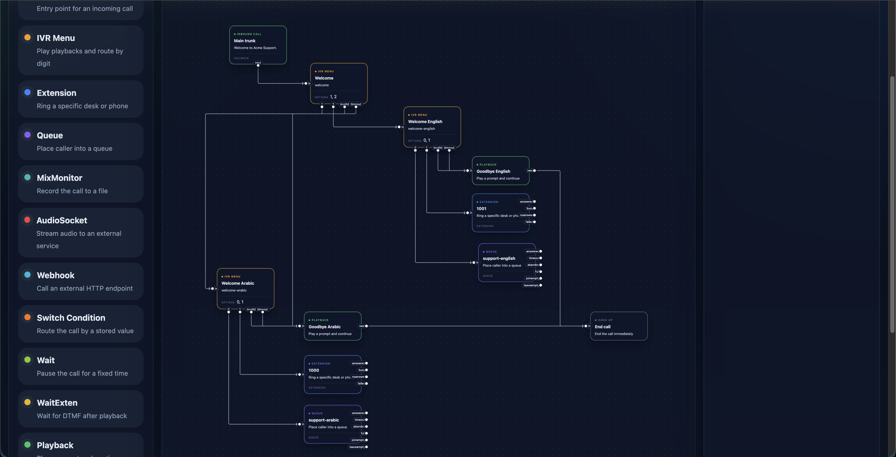

# Asterisk Call Flow Builder

Visual editor for designing Asterisk inbound call flows. Build an IVR on a canvas,
connect routing logic, validate the graph, and export a ready-to-use
`extensions.conf` dialplan.

Built with React, Vite, React Flow, and Tailwind CSS.



## Features

- Drag-and-drop canvas for building call flows.
- Node-based editor for common Asterisk blocks:
  - `Inbound Call`
  - `IVR Menu`
  - `Extension`
  - `Queue`
  - `MixMonitor`
  - `AudioSocket`
  - `Webhook`
  - `Switch Condition`
  - `Wait`
  - `WaitExten`
  - `Playback`
  - `NoOp`
  - `Set`
  - `Read Digit`
  - `Hang Up`
- Context-aware property panel for editing node metadata.
- Graph validation for missing routes, orphaned nodes, and required fields.
- Asterisk export that generates an `extensions.conf` file.
- Queue strategy support including `ringall`, `leastrecent`, `fewestcalls`,
  `random`, `rrmemory`, `rrordered`, `linear`, and `wrandom`.

## Tech Stack

- React 19
- Vite 8
- React Flow 11
- Tailwind CSS 4

## Getting Started

```bash
npm install
npm run dev
```

Open the local URL shown by Vite.

## Available Scripts

```bash
npm run dev      # Start the development server
npm run build    # Build the production bundle
npm run preview  # Preview the production build
npm run lint     # Run ESLint
```

## How It Works

1. Add nodes from the palette.
2. Connect node handles to define call routing.
3. Edit node settings in the side panel.
4. Validate the graph before exporting.
5. Download the generated `extensions.conf` and use it in Asterisk.

The export uses `[from-internal]` as the entry point and creates one context per
node, wiring call paths together with `Goto` and related dialplan commands.

## Example Output

```ini
; Generated by Asterisk Call Flow Builder
; Drop this into /etc/asterisk/extensions.conf or an included custom file

[from-internal]
exten => s,1,NoOp(Inbound call from flow builder)
 same => n,Answer()
 same => n,Playback(Welcome to Acme Support.)
 same => n,Goto(welcome,s,1)

[welcome]
exten => s,1,NoOp(Welcome)
 same => n,Playback(welcome)
 same => n,Read(IVR_DIGIT,beep,1,,1,10)
 same => n,GotoIf($["${IVR_DIGIT}"="1"]?welcome_arabic,s,1)
 same => n,GotoIf($["${IVR_DIGIT}"="2"]?welcome_english,s,1)
 same => n,GotoIf($["${IVR_DIGIT}"=""]?playback-goodbye_arabic,s,1)
 same => n,Goto(playback-goodbye_arabic,s,1)

[queue-support-arabic]
exten => s,1,NoOp(Queue support-arabic)
 same => n,Queue(support-arabic)
 same => n,NoOp(Queue strategy rrordered)

[welcome_arabic]
exten => s,1,NoOp(Welcome Arabic)
 same => n,Playback(welcome-arabic)
 same => n,Read(IVR_DIGIT,beep,1,,1,10)
 same => n,GotoIf($["${IVR_DIGIT}"="0"]?queue-support-arabic,s,1)
 same => n,GotoIf($["${IVR_DIGIT}"="1"]?ext-1000,s,1)
 same => n,GotoIf($["${IVR_DIGIT}"=""]?playback-goodbye_arabic,s,1)
 same => n,Goto(playback-goodbye_arabic,s,1)

[welcome_english]
exten => s,1,NoOp(Welcome English)
 same => n,Playback(welcome-english)
 same => n,Read(IVR_DIGIT,beep,1,,1,10)
 same => n,GotoIf($["${IVR_DIGIT}"="0"]?queue-support-english,s,1)
 same => n,GotoIf($["${IVR_DIGIT}"="1"]?ext-1001,s,1)
 same => n,GotoIf($["${IVR_DIGIT}"=""]?playback-goodbye_english,s,1)
 same => n,Goto(playback-goodbye_english,s,1)

[queue-support-english]
exten => s,1,NoOp(Queue support-english)
 same => n,Queue(support-english)
 same => n,NoOp(Queue strategy rrordered)

[ext-1001]
exten => s,1,NoOp(Ringing extension 1001)
 same => n,Dial(PJSIP/1001,20)
 same => n,Hangup()

[ext-1000]
exten => s,1,NoOp(Ringing extension 1000)
 same => n,Dial(PJSIP/1000,20)
 same => n,Hangup()

[playback-goodbye_arabic]
exten => s,1,NoOp(Playback good-bye-arabic)
 same => n,Playback(good-bye-arabic)
 same => n,Goto(hangup,s,1)

[playback-goodbye_english]
exten => s,1,NoOp(Playback good-bye-english)
 same => n,Playback(good-bye-english)
 same => n,Goto(hangup,s,1)

[hangup]
exten => s,1,Hangup()
```

## Project Structure

```text
index.html          # App shell
src/main.jsx        # React entry point
src/App.jsx         # Editor, node logic, validation, and export
src/index.css       # Global styles
```

## Notes

- The exported dialplan is intended as a starting point and should be reviewed
  before production use.
- `README.md` is written to work well on GitHub as the project landing page.
